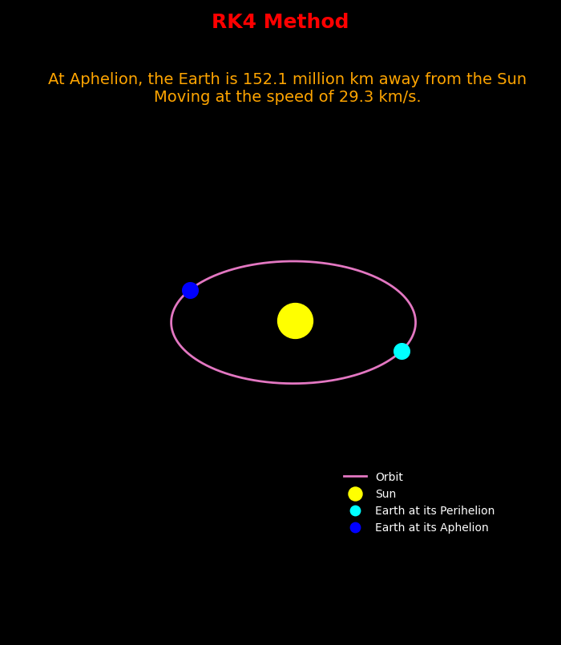

**1)** <a href="#ps">Problem Statement</a>                            
   **1.1)** <a href="eqn">Given Equations</a>                      
   **1.2)** <a href="preihelion">Initial Conditions</a>                
   **1.3)** <a href="earth_output">Simulated Output</a>                                
**2)** <a href="setup">Setup:- Simulate any Planet's Orbit in our Solar System</a>       
**3)** <a href="useage">Understanding `config.json` for Simulation Parameters</a>            
**4)** <a href="sheet">Simulate any planet of your choice</a>                       
---

# 1) <h1 id="ps">Problem Statement</h1>

* Create a simulation to track the orbit of the Earth around the Sun for a period of 1 year.
* Use Euler and Runge - Kutta method of 4th order (RK4) for this task.
* Find the distance from Earth to Sun at Apogee using Euler and RK4 method and compare it with the original.

   ## 1.1) <h1.1 id="eqn">Given Equations</h1.1>

   * Accn of Earth due to Gravity of the Sun 
       * $a = -\frac{GM}{|r|^3}\times\vec{r}$
   
   * ODE for Position
       * $\frac{dr}{dt} = v$ 
   
   * ODE for Velocity
      * $\frac{dv}{dt} = a$
   
   ## 1.2) <h3 id ='perihelion'>Initial Condition</h3>
   * Earth is at its Perihelion (closest to Sun)
   
   ## 1.3) <h4 id='earth_output'>Simulated Output</h4>
   * Take a look at the output of the Earth's Orbit:-

---

# 2) <h5 id='setup'>Setup:- Simulate any Planet's Orbit in our Solar System</h5>
1. Clone the Repository:- `https://github.com/SpartificialUdemy/PSA.git`
2. Change into the project directory:- cd "M5 - Earth's Orbit around the Sun"
4. Install `requirements.txt`:- pip install -r requirements.txt
5. <a href="#useage">Configure</a> the Simulation Parameters using `config.json`
6. Run the `main.py` file
7. Simply, change the Silumation Parameters to simulate different Planets in our Solar System

---

# <h6 id='useage'>3) Understanding `config.json` for Simulation Parameters</h6>
Change the Simulation Parameters using [config.json](https://github.com/SpartificialUdemy/PSA/blob/main/M5%20-%20Earth's%20Orbit%20around%20the%20Sun/config.json):- 

   **a)** Planet Info:                                              
      → `name`: The name of the Planet to Display on the Plot.                      
      → `perihelion_color`: The color to give to the Planet at its Perihelion.                   
      → `aphelion_color`: The color to give to the Planet at its Aphelion.                  
                                 
   **b)** Initial Conditions:                                                                             
      → `position_at_perihelion`: The closest distance between the Sun and the Planet `(in million km)`.                                                                                       
      → `velocity_at_perihelion`: The value of speed at the Planet's Perihelion `(in km/s)`.                 
                          
   **c)** Time Settings:                                                                             
      → `time_step`: The steps in the Simulation for updating position and velocity `(in seconds)`.      
      → `simulation_time`: The maximum time of the simulation `(in days \rarr 1 day = 24 hours)`.      
                               
   **d)** Numerical Integration:                                                              
      → `method`: The method to choose for Numerical Integration `(either "RK4" or "Euler")`.      

---

# 4) <h7 id='sheet'>Simulate any planet of your choice</h7>
* Here is the [Planetary Fact Sheet](https://nssdc.gsfc.nasa.gov/planetary/factsheet/
) that you can refer.
